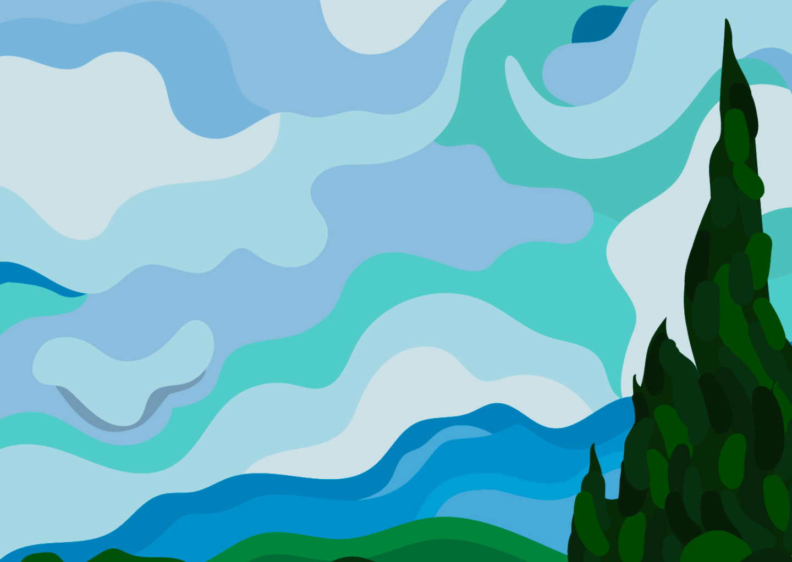
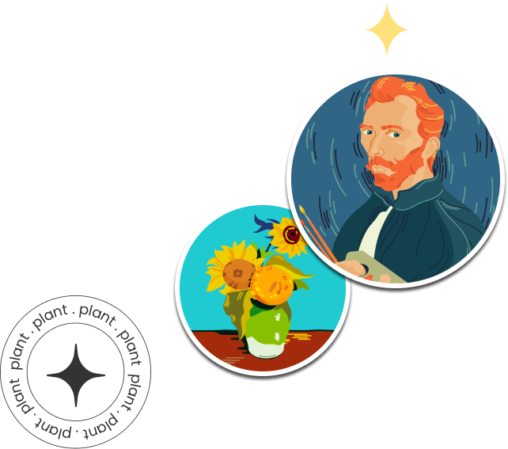

# Landing Page-2
>Praticando com landing page, segundo repositório, para manter o conhecimeto em dia :D

### Criando arquivos
``index.html``

``style.css``

### Base do HTML para iniciar o trabalho
```html
<!DOCTYPE html>
<html lang="en">
<head>
    <meta charset="UTF-8">
    <meta http-equiv="X-UA-Compatible" content="IE=edge">
    <meta name="viewport" content="width=device-width, initial-scale=1.0">
    <title>Document</title>
</head>
<body>
    
</body>
</html>
```

### Formatando o CSS
```css
* {
    margin: 0;
    padding: 0;
    box-sizing: border-box;
}
```

### Imagens adicionadas
>Background




>Van-gogh




>Setas, esquerda e direita


### Importando fontes no CSS
```css
@import url('https://fonts.googleapis.com/css2?family=Raleway:wght@300;400;500;600&display=swap');
@import url('https://fonts.cdnfonts.com/css/histora-beralin');
```

### Criando variáveis no CSS
```css
:root {
    --font-family-raleway: 'Raleway', sans-serif;
    --font-family-histora: 'Histora Beralin', sans-serif;
    --font-size-xSmall: 20px;
    --font-size-small: 22px;
    --font-size-medium: 24px;
    --font-size-large: 30px;
    --font-size-xLarge: 96px;
    --color-white: #FFFFFF;
    --color-yellow: #FFDB60;
    --color-brown: #271908;
}
```